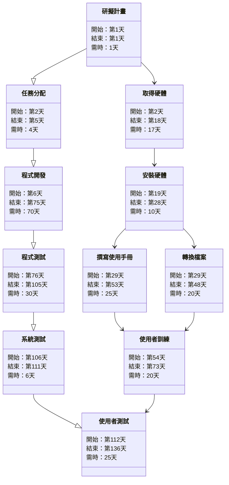

```mermaid
classDiagram

研擬計畫 --|> 任務分配
研擬計畫 --> 取得硬體
任務分配 --|> 程式開發
取得硬體 --> 安裝硬體
程式開發 --|> 程式測試
安裝硬體 --> 撰寫使用手冊
安裝硬體 --> 轉換檔案
程式測試 --|> 系統測試
撰寫使用手冊 --> 使用者訓練
轉換檔案 --> 使用者訓練
系統測試 --|> 使用者測試
使用者訓練 --> 使用者測試

研擬計畫 : 開始：第1天
研擬計畫 : 結束：第1天
研擬計畫 : 需時：1天

任務分配 : 開始：第2天
任務分配 : 結束：第5天
任務分配 : 需時：4天

取得硬體 : 開始：第2天
取得硬體 : 結束：第18天
取得硬體 : 需時：17天

程式開發 : 開始：第6天
程式開發 : 結束：第75天
程式開發 : 需時：70天

安裝硬體 : 開始：第19天
安裝硬體 : 結束：第28天
安裝硬體 : 需時：10天

程式測試 : 開始：第76天
程式測試 : 結束：第105天
程式測試 : 需時：30天

撰寫使用手冊 : 開始：第29天
撰寫使用手冊 : 結束：第53天
撰寫使用手冊 : 需時：25天

轉換檔案 : 開始：第29天
轉換檔案 : 結束：第48天
轉換檔案 : 需時：20天

系統測試 : 開始：第106天
系統測試 : 結束：第111天
系統測試 : 需時：6天

使用者訓練 : 開始：第54天
使用者訓練 : 結束：第73天
使用者訓練 : 需時：20天

使用者測試 : 開始：第112天
使用者測試 : 結束：第136天
使用者測試 : 需時：25天
```
