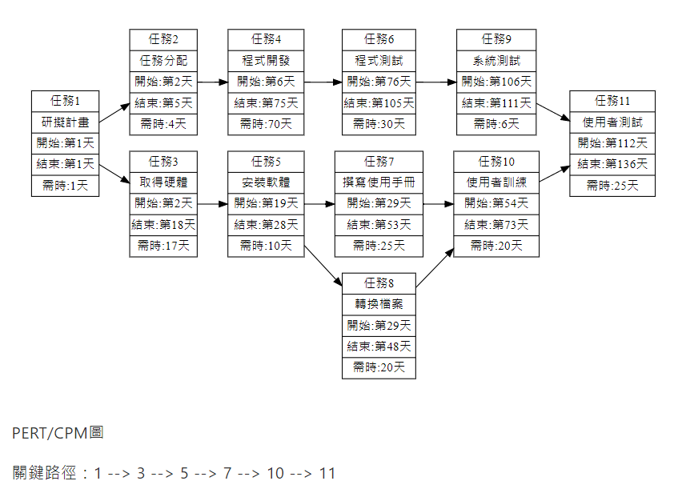
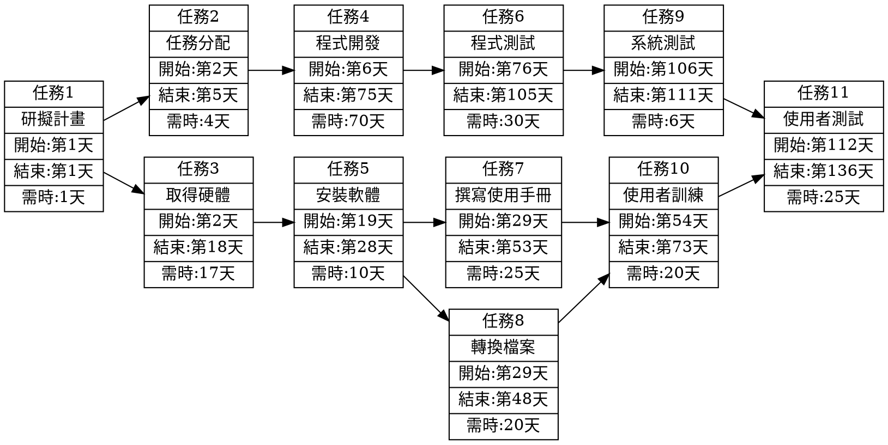

```graphviz
digraph {
	node[shape=record];
	rankdir="LR";
    no1 [label = "任務1 | 研擬計畫 | 開始:第1天 | 結束:第1天 | 需時:1天"]
    no2 [label = "任務2 | 任務分配 | 開始:第2天 | 結束:第5天 | 需時:4天"]
    no1->no2
    no1->no3
    no3 [label = "任務3 | 取得硬體 | 開始:第2天 | 結束:第18天 | 需時:17天"]
    no2->no4
    no4 [label = "任務4 | 程式開發 | 開始:第6天 | 結束:第75天 | 需時:70天"]
    no3->no5
    no5 [label = "任務5 | 安裝軟體 | 開始:第19天 | 結束:第28天 | 需時:10天"]
    no4->no6
    no6 [label = "任務6 | 程式測試 | 開始:第76天 | 結束:第105天 | 需時:30天"]
    no5->no7
    no5->no8
    no7 [label = "任務7 | 撰寫使用手冊 | 開始:第29天 | 結束:第53天 | 需時:25天"]
    no8 [label = "任務8 | 轉換檔案 | 開始:第29天 | 結束:第48天 | 需時:20天"]
    no6->no9
    no9 [label = "任務9 | 系統測試 | 開始:第106天 | 結束:第111天 | 需時:6天"]
    no7->no10
    no8->no10
    no10 [label = "任務10 | 使用者訓練 | 開始:第54天 | 結束:第73天 | 需時:20天"]
    no9->no11
    no10->no11
    no11 [label = "任務11 | 使用者測試 | 開始:第112天 | 結束:第136天 | 需時:25天"]  
}
```
